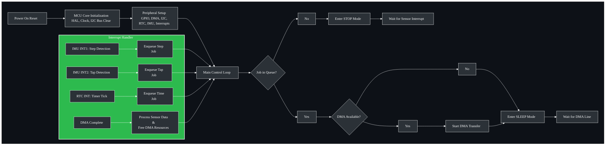

# STM32 Fitness Tracker with MIP Display
A simple fitness tracker based on the STM32U0 microcontroller that utilizes low-power modes, DMA-based I2C data transfers, and an ultra-low-power MIP display to maximize battery life.
___
### Hardware Components
| Description | Part |
| :------- | -------:|
| Arm Cortex-M0+ MCU  | [STM32U0](/Datasheets/stm32u031f4.pdf) |
| Accelerometer with built-in pedometer  | [LSM6DSR](/Datasheets/LSM6DSR.pdf) |
| RTC  | [MAX31331](/Datasheets/MAX31331.pdf) |
| MIP display  | [TN0104ANVAANN](/Datasheets/TN0104ANVAANN-GN00_Spec.pdf) |
| Coin Cell  (4.2-3.6V, 120mAh )  | LIR2450 |

### Software + Tools
- PCB Design: KiCAD (Schematic and 4-layer board design)
- Firmware Development: STM32CubeIDE with HAL drivers
- Programming: ST-Link V2 debugger/programmer
- Version Control: Git with structured project management
___
### PCB Design
**4-Layer Stackup: Signal - GND - Power - Signal**:
|  | Image | Contents |
| :-------:  | :-------: | :-------: |
|Schematic| |  |
|Signal| | Short traces, Decoupling caps, Copper pours, Test pads |
|GND| | A continuous ground plane to maximize signal integrity and minimize EMI |
|Power| |  A clean power plane for efficient power distribution with minimal voltage drop |
|DFM | | Designed around JLCPCB's design constraints, with design-for-testability (DFT) considerations, including test points and adequate component spacing. |
___

### System Architecture

___
### Key Features
- **Interrupt-driven firmware:** Interrupts from sensors queue jobs, preventing the need to continuously poll for updated data.
   - The IMU handles step/tap detection and only wakes the MCU when a new event occurs.
   - The RTC generates periodic interrupts for timekeeping and display refreshes.
- **Custom RTC Driver:** Wrote a platform-independent driver for the MAX31331 that provides:
   - Time/date get + set functions
   - Timer configuration + clock calibration
   - Interrupt setup
- **Direct Memory Access (DMA):** I²C data from the sensors is transferred in the background, while the CPU is in SLEEP mode.
- **Dynamic Power Management:** The firmware enters STOP mode when idle and SLEEP mode during DMA operations, waking only to process data from the sensors.
- **Memory-in-Pixel (MIP) display:** The display only consumes energy when the content is updated.

### Build & Flash
- Open project in STM32CubeIDE.
- Build firmware (`Project → Build Project`).
- Connect ST-Link V2 over SWD
   - SWDIO → SWDIO
   - SWCLK → SWCLK
   - VCC   → 3.6-5V
   - GND   → GND
- Flash firmware (`Run -> Run/Debug`)

### Debugging
   - Arm Cortex-M0+ MCUs do not support SWV, so SWO debug output is unavailable.
   - Use CubeIDE debugger with:
      - Breakpoints for interrupt handling.
      - Live Expressions to monitor variables (e.g., step counts, clock).
___
### Roadmap
- **User Input:** Add tactile buttons for UI interaction.
- **Power System:** Integrate a coin-cell holder with a BMS for charging support.
- **Peripheral Control:** Dedicate pins on the MCU to enable/disable sensors for proper power sequencing.
- **UART:** Add UART RX/TX headers for logging & debug.
- **Future Plans:** BLE, heart-rate sensor.